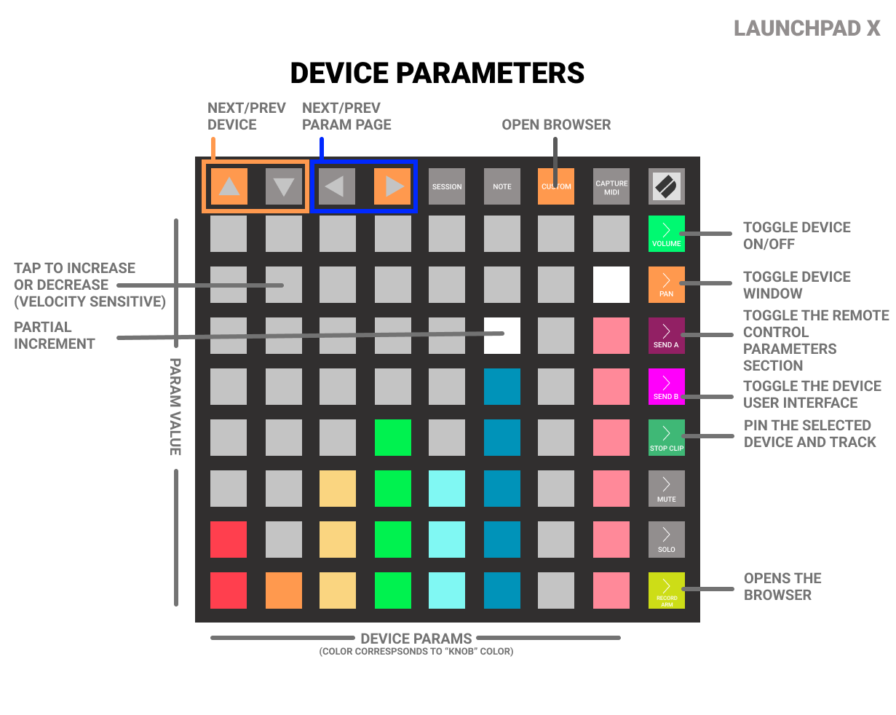

# Novation Launchpad

The following of Novation's Launchpad controllers are supported:

* Launchpad Pro
* Launchpad ProMk3
* Launchpad Mk2
* Launchpad Mini Mk3
* Launchpad X

## Installation

If you added the controller manually, choose the following in-/output ports:

* Pro Mk3: choose the 1st port (e.g. *LPProMK3 MIDI* on Windows).
* Pro, Mini Mk3, X: choose the 2nd port (e.g. *MIDIIN2 (Launchpad Pro)* and 
  *MIDIOUT2 (Launchpad Pro)* on Windows).
* Make sure the Launchpad sends on Midi Channel 1!
* To have pads blinking in sync with your song tempo activate to send MIDI clock to the device.

## Differences between the Launchpad models

The Pro models have an additional left column and bottom row of buttons.

Especially, they have a **Shift** button to access additional functionality (see the _Shift Mode_ below).
To work around this missing button on the other models another button has to function as the Shift button. It is the last button of the top button row (MkII: **Mixer**, Mini Mk3: **User**, X: **Capture Midi**).

The three buttons on the top row, right to the cursor keys are named differently on the models:

* Pro Mk1: Session, Note, Device
* MkII: Session, User 1, User 2
* X: Session, Note, Custom
* Mini Mk3: Session, Drums, Keys

These differences will not be mentioned again in the following text and **only the names of the Pro model will be used!**

### Pro Mk3

The differences on the Pro Mk3 are more drastic. It contains an additional row of buttons to select a track on the bottom. Additional functions are available in combination with the Clear button, to delete a track and the Duplicate button to duplicate a track.

Furthermore, some buttons were moved to a button which needs to be used in combination with the Shift button, e.g. for Undo press Shift+Record Arm. The implementation follows the labels on the buttons.

## Transport and Editing (Left button column)

* **Shift** - Use in combination with other buttons for additional functionality.
* **Click** - Toggle the metronome
* **Shift+Click** - Tap Tempo
* **Undo** - Undo. Press Shift for Redo.
* **Delete** - Hold the button for additional functionality in combination with other buttons knobs, see the view explanations below.
* **Shift+Delete** - Toggle repeat
* **Quantise** - Quantises the selected clip.
* **Record Quantise** - Press multiple times to toggle througgh the record quantisation settings.
* **Duplicate** (**Clear** on the Pro Mk3) - Always duplicates the first selected clip on the current track if pressed with no other button.
  * Launchpad Pro: Keep the Duplicate button pressed and select a clip in session mode to duplicate it
  * Launchpad Pro: Keep the Duplicate button pressed and select a pad from the 1st row when a track mode is on to duplicate the track.
  * Launchpad Pro: Keep the Duplicate button pressed and select a scene to duplicate it.
* **Shift+Duplicate** - Double the currently selected MIDI clip incl. its' content.
* **Double** (**Play** on the Pro Mk3) - Start/Stop playback. Double click to move play cursor to start of song.
* **Shift+Double** (**Play** on the Pro Mk3) - Creates a new clip on the selected track and slot, starts play and enables overdub.
* **Record** - Start/Stop recording
* **Shift+Record** - Toggle launcher overdub

## Cursors and Mode selection (Upper button row)

* **Arrows** - Navigate in the different modes (see below), holding an arrow button down will scroll through the specific View (e.g. track, scene).
* **Session** - Selects the Session mode to start, stop and record clips. Session can be flipped if Session button is pressed twice.
    Long press Session to select *birds-eye-view* to quickly navigate the clip grid. Press Session again to leave this mode.
* **Note** - Pressing the Note button brings up a menu where you can select the note/sequencer mode. First row (from top) selects play modes, 3rd row drum modes and 5th row sequencer modes. On the **Pro Mk3** pressing the Note button toggles through the 3 play modes.
* **Device** - Selects the Device mode to change the Parameters of the currently selected device. If pressed again it opens 
    the browser for preset selection mode. If no device is selected the browser is opened to insert a device.
* **Shift+Device** - Opens the device browser to add a device after the currently selected one
* **User** (only Pro, **Custom** on the Mk3) - Brings up the user mode.
* **Chord** (only Pro Mk3) - Toggles through the 3 drum sequencer modes.
* **Sequencer** (only Pro Mk3) - Toggles through the 3 note sequencer modes.

Note: The preferred play/sequencer mode is remembered for each track.

## Shift Mode

If you press the Shift button (and keep it pressed) the grid changes to the Shift mode. The **first column (from the left)** of the grid now represents the missing left column of the Pro model.
The **second column** represents the functions of these buttons in Shift state.

Pressing the **Delete (pink) or Duplicate (purple) pads** in shift mode activates the related mode. The pad starts to blink to indicate that the Delete/Duplicate mode is enabled. Press the pad again to cancel the mode. Leaving the shift mode and entering session mode allows then to delete/duplicate clips, scenes and tracks. After deleting/duplicating an item the delete/duplicate mode is automatically turned off.

The **Scene buttons** represent the missing bottom row of the Pro (Volume, Pan, etc. but differently ordered).
The colors of the buttons are identical. This area is empty on the Pro model.

Press the **Session** button to enter Mix-Mode.

Further functions (all models):

* The pads of the first row (from the bottom) change the length of newly created clips.
* The three green buttons in the right upper corner insert an instrument, audio or effect track.
* The red button in the lower right corner stops the playback of all clips.
* The buttons in the center control note repeat for play modes. The blue button on top de-/activates note repeat. The pads of the first two columns below change the note repeat period and the other two columns the note length.

## Track Control (Lower button row)

These buttons only work in the Session mode. If the Session mode is not yet selected it gets activated.

* **Record Arm** - The 8 buttons of the bottom row of the grid allow to toggle record arm of the currently focused 
  8 tracks of the track bank.
* **Track Select** - The 8 buttons of the bottom row of the grid allow to select one of the currently focused 8 tracks 
  of the track bank. The currently selected track is indicated on the first row (round) buttons by a brighter white. 
  Furthermore, the front LED is also lit in the color of the current track.
* **Mute** - The 8 buttons of the bottom row of the grid allow to toggle Mute of the currently focused 8 tracks of the 
  track bank.
* **Solo** - The 8 buttons of the bottom row of the grid allow to toggle Solo of the currently focused 8 tracks of 
  the track bank.
* **Volume** - Each column of the grid controls the Volume of the currently focused 8 tracks of the track bank. Hit 
  buttons harder for faster change. The color of a fader is the same as the color of the track. Use the scene buttons 
  for master volume.
* **Pan** - Each column of the grid controls the Panorama of the currently focused 8 tracks of the track bank. Hit 
  buttons harder for faster change. The color of a fader is the same as the color of the track.
* **Sends** - Each column of the grid controls the Send of the currently focused 8 tracks of the track bank. Hit 
  buttons harder for faster change. The color of a fader is the same as the color of the track. Use the Scene buttons 
  to select the Sends 1 to 8.
* **Stop Clip** - The 8 buttons of the bottom row of the grid allow to stop the playing clip of the track of the 
  currently focused 8 tracks of the track bank.

### Shifted functions on the Pro models

* **Shift+Record Arm**: Undo
* **Shift+Mute**: Redo
* **Shift+Solo**: Toggle Metronome
* **Shift+Sends**: Tap Tempo
* **Shift+Solo**: Toggle Metronome
* **Shift+Device**: Enter tempo mode
* **Shift+Stop Clip**: Enter swing mode

## Session Mode

Press _"Session"_ to enter **Session** mode. Press again to toggle the clip orientation (vertical or horizontal).
_Long press_ to enter birds-eye-view.

* The buttons on the grid start/record the clips.
* Long press a pad to select the clip without starting it.
* The 8 scene buttons on the right start the scenes.
* The arrow keys scroll the grid. Hold **Shift** to scroll in blocks of 8.
* Hold **Delete** and press a clip button to delete the clip.
* Hold **Delete** and press a Scene button to delete the scene.

## Selecting Note or Sequencer Modes

Press _"Note"_ to choose a **Note** or **Sequencer** mode.
On the **Pro Mk3** use the **Note**, **Chord** and **Sequencer** buttons to toggle through the modes.

* The first three (red) pads represent **Play** modes - Scale, Piano, and Drum64.
* The second three (blue) pads represent **Drum Sequencer** modes - Drum, Drum4, and Drum 8
* The final three (orange) pads represent **Note Sequencer** modes - Sequencer, Poly, and Raindrop

## Play modes

### Note Mode (Playing the pads)

Press _"Note"_  and select the first red pad to change to **Scale** mode.

* The key layout is the same one used with Ableton Push
* Left/Right buttons change the scale (Major, Minor, etc.)
* Up/Down buttons transpose the note range (pitch) up/down.
* The upper 2 scene buttons change the key layout.
* The white scene button toggles between Chromatic and Scale Only mode.
* The lower 2 scene buttons change the root note of the scale.
* The played keys are lighting red if global or clip recording (does not work if recording clip is outside of the monitored 8x8 matrix)

  
### Piano Mode

Press _"Note"_ twice to enter.

* Arranges the pads like a classic piano keyboard.
* The white lit pads are the white keys.
* The gray lit pads are the black keys.
* You get 4 octaves to play with

### Drum 64 play mode

Press _"Note"_ multiple times to select *Drum 64*.

This mode gives you 64 pads for playing a drum device. The 16 pads in the left lower area are the same as in the drum sequencer mode.

## Sequencers

### Sequencer Functions common to all sequencers (except Raindrop)

* Use the arrow keys to navigate in the grid.
* Note that you can scroll past the end of the clip (to the right).
* Press pads to enter/delete notes. The velocity of the pressed key is set as well.
* Change the note length or create long notes by pressing a note pad and then a pad right of it.
* To duplicate notes keep the Dulicate button pressed, select the source note, press empty destination pad(s). The note will be copied with all settings.
* Note starts and lengths are lit in different colors.
* Use the Scene buttons to change the grids resolution.

### Sequencer Mode

Press _"Note"_  and select the first orange pad to enter the **Sequencer** mode:

* The pads display an 8x8 view of the selected clips note grid.
* The rows represent the notes of the selected scale.

### Poly Sequencer

Press _"Note"_ and select the second orange pad to change to the **Poly Sequencer**:

* The lower half displays the playable notes like in the Note Mode
* Play one or more notes in that area
* Create a step in the upper part by pressing a pad. The step will contain the last notes you played in the lower part.
* Arrow keys change the octaves and step pages

### Raindrop sequencer

Press _"Note"_ and select the third orange pad to change to the **Raindrop Sequencer**:

* The lowest row displays the playable notes
* The row above a note starts a raindrop
* If the raindrop reaches the note it sounds

### Drum Sequencer Mode

Press _"Note"_ and select the first blue pad to change to the **Drum Sequencer**.

* The drum sequencer works as described in the Ableton Push manual.
* Hold *Delete* + Drumpad to delete the midi notes of the current clip on that 'pad'.
* To make the display of mute/solo/exists states work, the primary device needs to be the drum machine (which is normally the case).
* The Drumpads use the colors set in the drum machine for each pad.

### Drum 4 and Drum 8 sequencer

Press _"Note"_ and select the second or third blue pad to change to *Drum 4* or *Drum 8*.

These drum sequencers show 4 or 8 drum sounds for sequencing. Use the cursor buttons to move in the clip.

## Device Mode

Press _"Device"_ to enter the **Device** mode:

* Each column of the grid controls a parameter of the currently selected device.
* These virtual faders use the same colors as the Bitwig highlight colors.
* Hit buttons harder for faster fader change.
* Cursor up/down to the next / previous device
* Cursor left/right to the next / previous parameter bank

## Browser Mode

Press _"Device"_ twice to enter the browser mode for preset selection. It will only enter the mode if a device is currently selected.
Press _"Shift+Device"_ to open the device browser to add a device after the currently selected one.

* The first 6 columns of the grid relate to the first 6 columns of the preset browser.
* The 8th column (yellow) relates to the result (preset or device) column of the browser.
* The 1st row moves the selection up by 1.
* The 2nd row moves the selection up by 8.
* The 3rd row moves the selection down by 8.
* The 4th row moves the selection down by 1.
* The red button dismisses the new preset or device selection and closes the browser.
* The green button confirms the new preset or device selection and closes the browser.
* The purple buttons are for previewing presets of instrument devices.
* Left/Right buttons switch to the next / previous browser tab.
* Up/Down buttons switch from replacing the current device to inserting a new device before or after it.

## Mix Mode

Press _"Shift+Session"_ to activate Mix mode.

This mode contains all session modes at once. The rows from bottom to top are:

* rec arm, 
* solo, 
* mute, 
* clip stop, 
* send 2, 
* send 1, 
* panorama, 
* volume.

The panorama and sends pad are only colored for the selected track. Press one of the pads of the upper 4 rows to select a track. Select a volume, panorama or sends pad to activate it and then change its value with the virtual fader of the scene buttons.

## Tempo mode

Press **Shift+Device** on the Pro models. On all other models, press Shift and either the arrow up or down button.

The grid displays the current tempo. Change the tempo with the cursor keys. Up/down change by 1 and left/right by steps of 10. You can also keep a button pressed for continuous changes.

Press any of the grid pads to exit this mode.

## Shuffle mode

Press **Shift+Stop clip** on the Pro models. On all other models. Press Shift and either the arrow left or right button.

The grid displays the current shuffle value. Change the value with the cursor keys. Up/down change by 1 and left/right by steps of (about) 10. You can also keep a button pressed for continuous changes.

Press any of the grid pads to exit this mode.

## Project mode (only Launchpad Pro Mk3)

Press the **Project** button to enter.

* Top Border (from left to right):
  * Switch to previous project (if multiple projects are open)
  * Toggle Audio Engine on/off of the selected project
  * Switch to next project (if multiple projects are open)
* Left Border: Toggle the inspector pane
* Right Border: Toggle the Browser pane
* Bottom Border (from left to right):
  * Toggle Note editor pane
  * Toggle Automation editor pane
  * Toggle Devices pane
  * Toggle Mixer pane
* Center buttons: Select layouts 1-3
* Cursor keys left/right: Zoom the arranger (arranger pane needs to be active!)
* Cursor keys up/down: Toggle track height (arranger or clip pane needs to be active!)

## Preferences Settings

You can set several preferences which are stored when you exit the DAW. These are global settings and not specific to projects.

### Play and Sequence

* Quantize Amount: The amount of quantization to use when Quantize is executed. 100% alignes all notes fully to the grid.

### Transport

* Behaviour on Stop: Sets the action to be executed when playback is stopped with the Play button
* Flip arranger and clip record / automation: if enabled, the functionality of the Record and Automation button when used with Shift is flipped with the function when not using Shift. Enable this if you tend to work more in the Clip Launcher than the Arranger.

### Session

* Flip Session: Change the orientation of the tracks/clips horizontal or vertical
* Select clip/scene on launch: If a clip/scene is started from the controller and this setting is off the clip/scene will not be selected. Use if you edit another clip and want not to change the focus.

### Drum Sequencer

* Auto-select drum settings: If *channel* is selected and a drum pad is played the display switches to the layer settings of the drum cell.
* Turn off empty drum pads: Empty drum cells are displayed in orange. If enabled they pad LEDs are off.

### Workflow

* Exclude deactivated items: If active, deactivated items like tracks will not be displayed on the controller. This cleans up the displayed banks but also prevents the options to activate an deactivated item from the controller.
* Include (Group-)Mastertrack: If set to off, the group-master tracks are removed from the track bank.
* New clip length: The length of a clip created with the New function.

### Pads

* Convert Poly Aftertouch to: The pads support poly aftertouch. If the device you play does not support this option allows to change it to Channel Aftertouch or a MIDI CC command.

## Document Settings

These settings are specific to each project.

### Scales

* Scale: Select the scale
* Base: Select the base note of the scale
* In Key: Select *Chromatic* to also display notes which are not part of the scale.
* Layout: Select the layout of the scale for the Play mode. The numbers are the offsets between the rows of the grid. The arrows depict the direction from lower to higher notes: left to right or bottom to top.

### Note Repeat

* Active: Enable note repeat
* Period: The repeat rate of the note repeat
* Length: The length of a repeated note
* Mode: The arpeggiator mode
* Octave: The octave range which is used by the arpeggiator

 
\pagebreak 

